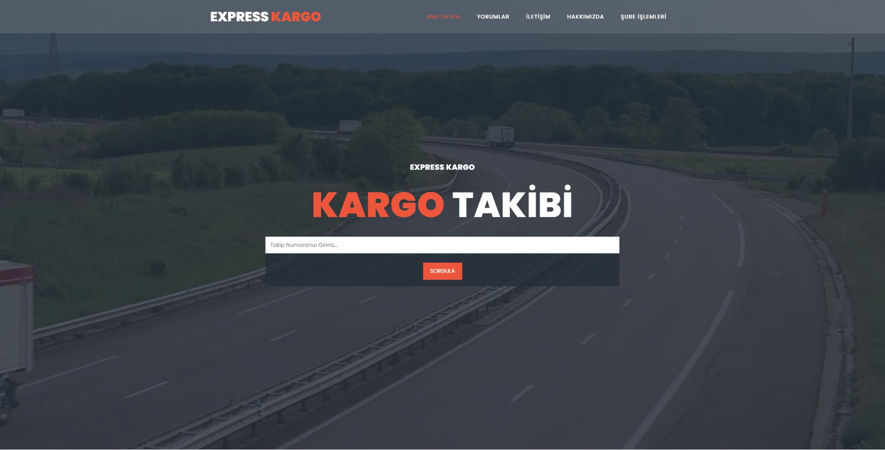

# Express Cargo

Bu proje [Kodluyoruz](https://kodluyoruz.org/) K130 Ankara C# ile .Net Core Bootcamp bitirme projesi olarak [Tarık Aydın](https://www.linkedin.com/in/trkaydn/) tarafından Ekim 2021 tarihinde hazırlanmıştır.

Express Kargo, Asp Net Core 5.0 MVC ile geliştirilmiş bir kargo otomasyonudur. Bu projede **EntityFramework, FluentValidation, AutoMapper** kütüphaneleri kullanılmıştır.

## Kullanım Senaryosu

Kargo Şubeleri, şube adları ve şifreleri ile sisteme giriş yaparlar. Giriş yaptıktan sonra yeni kargo kabulü, var olan kargoların durumunu güncelleyebilme yetkilerine sahiptirler. Her yeni kargo girişinde 12 haneli random bir takip numarası oluşturulmaktadır. Kargoların güncellenme ise aşamaları tarih bilgisi ile birlikte veritabanına tek tek kaydedilmekte olup, geçilen bir aşamadan geriye dönük güncelleme mümkün değildir. 

Her şube sadece göndericisi veya alıcısı olduğu kargolar üzerinde görüntüleme ve güncelleme yetkisine sahiptir.
Tüm şubeler, iletişim sayfasından iletilen mesajları okuyabilir ve silebilir, buna ek olarak siteye yapılan yorumları onaylama ve silme, şifre değiştirme yetkilerine sahiptir.

Herkese açık arayüzde ise kullanıcılar kargo takip numaraları ile takip işlemlerini yapabilir, firmamıza yorum bırakabilir, iletişim formuyla bilgi edinebilirler.

## Teknik Detaylar

Bu proje **Asp Net Core 5.0 MVC** ile **4 katmanlı mimari** üzerine kurulmuştur. **EntityLayer, DataAccessLayer, BusinessLayer** ve **PresentationLayer** katmanlarından oluşmaktadır.

Veritabanı işlemleri için **EntityFramework** ile **Code First** yaklaşımı kullanılmıştır. Kullanıcıdan alınan tüm girdiler **FluentValidation** kütüphanesi ile validasyon kontrolünden geçmektedir.

View'larda entity kullanılmamıştır. Her view için **ViewModel** yazılmış olup bu ViewModeller **AutoMapper** kütüphanesi kullanılarak entitylere maplenmiştir. 

Kullanıcı şifreleri veritabanında **SHA512** algoritması ile hashlenmiş olarak tutulmaktadır. 

Runtime esnasında karşılaşılan hatalar **Middleware** yardımıyla veritabanına kayıt edilmektedir. Bu hatalar yönetici panelinde liste olarak görülebilmektir. 

Frontend tarafında hazır template kullanılmış olup, **ajax** işlemleri için tarafımca birkaç **script** yazılmıştır.